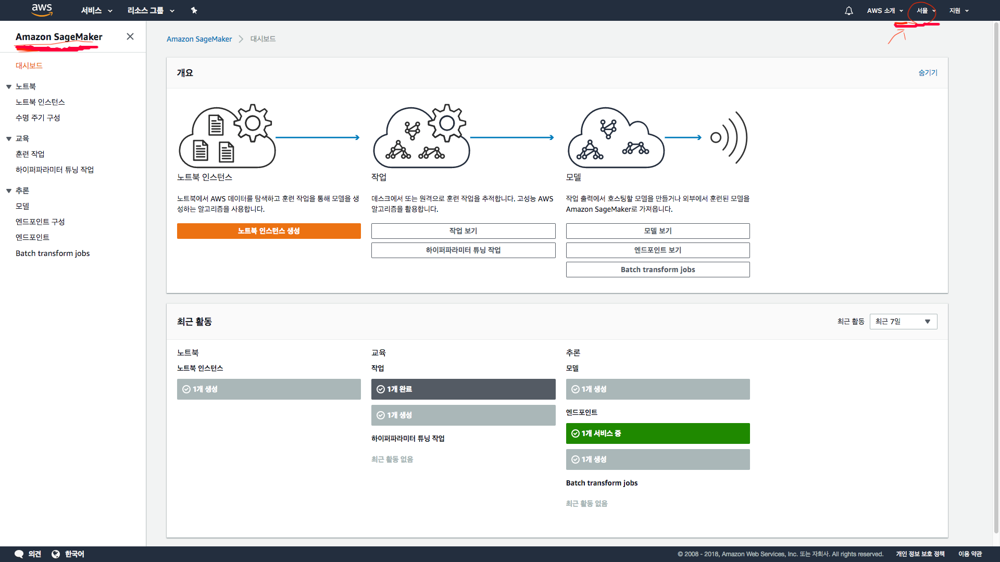
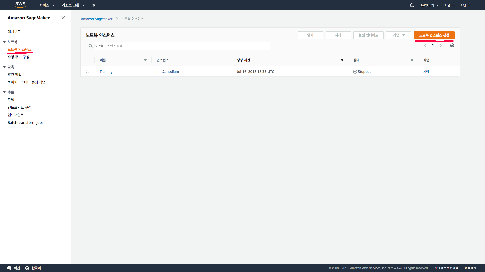
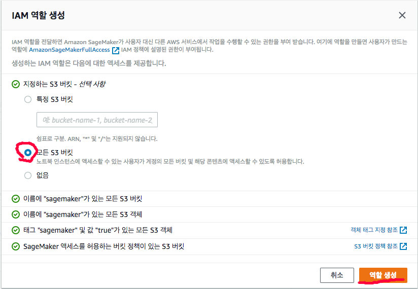
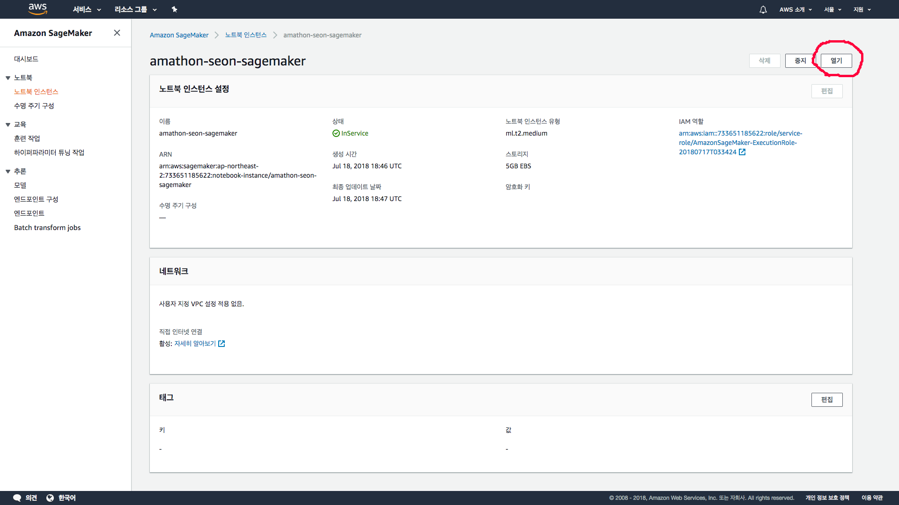
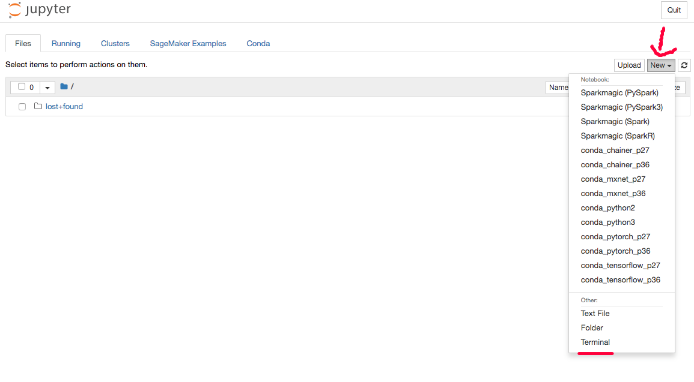

# Amazon SageMaker 를 활용하여 MNIST 머신러닝 맛보기
Amathon 2018 advance education

## 0. 세션목표
1. Amazon SageMaker 인스턴스를 생성하여본다.
2. SageMaker를 활용해 머신러닝을 공부해본다.
3. SageMaker를 사용해 모델을 배포하여본다.

## 1. Amazon SageMaer
- Jupyter 노트북 지원
- 구축, 학습, 배포의 단계를 모두 지원
- 머신러닝 알고리즘 내장
- 딥러닝 프레임워크 내장 (Tensorflow, MXNet, PyTorch, ...)
- 생각보다 빠름(?), 평범한 컴퓨터 보다는 빠르다.
- 단점 : 인스턴스가 가격이 조금 나간다...

## 2. Amazon SageMaker 인스턴스 실행하기.

### 1) AWS 서울리전 접속 및 Amazon SageMaker 대시보드 들어가기


### 2) 인스턴스 생성하기
1. 좌측의 목록에서 ***노트북 인스턴스*** 를 클릭합니다.
2. 이동한 창에서 우측상단 ***노트북 인스턴스 생성*** 버튼을 클릭합니다.

3. 인스턴스 이름 : amathon-{이름}-sagemaker
4. 노트북 인스턴스 유형 : ml.t2.medium
5. IAM 역할 -> 새 역할 생성 -> 모든 S3 버킷 선택 -> 역할 생성

6. 다시한번 IAM역할 클릭 -> 기존역할사용의 생성된 역할 선택
7. 노트북 인스턴스 생성

### 3) 인스턴스 실행하기
1. 생성된 인스턴스의 이름 클릭
2. 우측 상단의 열기 클릭

3. 우측 상단의 ***NEW*** 클릭
4. 드랍박스에서 ***Terminal*** 클릭

5. 터미널에 다음 순서대로 타이핑

```
cd SageMaker

git clone https://github.com/whitesoil/amathon-sagemaker.git
```